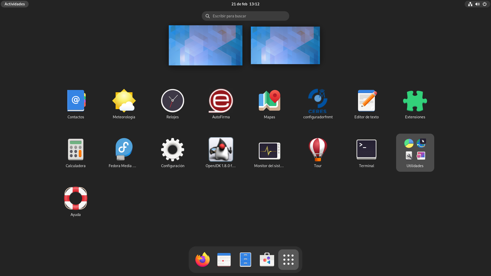

[ESBlue][1]
===========

Una imagen personalizada basada en
[BlueVanilla][2]/[BlueFusion][3]/[BlueRock][4] con los paquetes necesarios para
usar los certificados digitales del Gobierno de España.

Uso
---

1. Actualiza tu Fedora Silverblue a la imagen sin firmar para obtener las claves
   de firma necesarias:

       rpm-ostree rebase -r ostree-unverified-registry:ghcr.io/aguslr/esbluerock:stable

2. Actualiza de nuevo a la image firmada para acabar la instalación:

       rpm-ostree rebase -r ostree-image-signed:docker://ghcr.io/aguslr/esbluerock:stable

Otra opción es generar una [imagen ISO para una instalación *offline*][8] con el
siguiente comando:

    sudo podman run --rm --privileged \
        --volume .:/build-container-installer/build \
        --security-opt label=disable --pull=newer \
        ghcr.io/jasonn3/build-container-installer:latest \
        IMAGE_REPO="ghcr.io/aguslr" \
        IMAGE_NAME="esbluerock" \
        IMAGE_TAG="latest" \
        VARIANT="Silverblue"

Características
---------------

- Añade los siguientes paquetes a Silverblue:
  + `java-17-openjdk`
  + [`autofirma-1.8.3-1.noarch_FEDORA.rpm`][5]
  + [`configuradorfnmt-4.0.6-0.x86_64.rpm`][6]

Etiquetas
---------

Existen 3 variantes para esta image:

- `esbluevanilla`: Añade los paquetes a [BlueVanilla][2].

- `esbluefusion`: Añade los paquetes a [BlueFusion][3].

- `esbluerock`: Añade los paquetes a [BlueRock][4].

Verificación
------------

Estas imágenes están firmadas con [Cosign][7] de Sisgstore. Puedes verificar la
firma descargando el archivo clave `cosign.pub` de este repositorio y ejecutando
el siguiente comando:

    cosign verify --key cosign.pub ghcr.io/aguslr/esbluerock

[1]: https://github.com/aguslr/esblue
[2]: https://github.com/aguslr/bluevanilla
[3]: https://github.com/aguslr/bluefusion
[4]: https://github.com/aguslr/bluerock
[5]: https://firmaelectronica.gob.es/Home/Descargas.html
[6]: https://www.sede.fnmt.gob.es/descargas/descarga-software/instalacion-software-generacion-de-claves
[7]: https://docs.sigstore.dev/cosign/overview/
[8]: https://blue-build.org/learn/universal-blue/#fresh-install-from-an-iso
